# Practice Mode — n8n Backend Workflow Design

> Based on the "Practice Mode — Detailed Workflow & MVP" discussion document.

---

## Table of Contents
1. [System Overview](#system-overview)
2. [Agent Architecture](#agent-architecture)
3. [Complete Flow Diagram](#complete-flow-diagram)
4. [API Endpoints & Data Flow](#api-endpoints--data-flow)
5. [Question Data Structures](#question-data-structures)
6. [Firestore Schema](#firestore-schema)
7. [n8n Workflow Implementation](#n8n-workflow-implementation)
8. [Frontend-Backend Button Mapping](#frontend-backend-button-mapping)
9. [XP & Leveling Rules](#xp--leveling-rules)
10. [MVP Scope](#mvp-scope)

---

## System Overview

```mermaid
flowchart TB
    subgraph Student["👨‍🎓 Student Interface"]
        S1[Practice Chat UI]
        S2[Question Cards]
        S3[Topic Selection]
        S4[Session Summary]
    end

    subgraph Agents["🤖 n8n Agent System"]
        A1[Practice Chat Agent]
        A2[Question Fetcher & Variator]
        A3[Assessment Agent]
        A4[Reward Generator]
        A5[Analytics Extractor]
    end

    subgraph Storage["🗄️ Firestore + Qdrant + Object Storage"]
        DB1[(Firestore: users)]
        DB2[(Firestore: practiceSessions)]
        DB3[(Qdrant: questionBank)]
        DB4[(Firestore: conversations)]
        DB5[R2 Bucket - Attachments]
    end

    S1 <--> A1
    A1 --> A2
    A2 --> DB3
    A1 --> A3
    A3 --> A4
    A4 --> DB2
    A5 --> DB2
    A5 --> S4
```



---

## Agent Architecture

> [!IMPORTANT]
> Keep Practice Chat Agent **isolated** from Learning Agent. Each agent has distinct responsibilities.

| Agent | Responsibility | n8n Implementation |
|-------|---------------|-------------------|
| **Practice Chat Agent** | Accept topic, fetch questions, present cards, accept answers, request feedback | Main Webhook + Router Node |
| **Question Fetcher & Variator** | Pull from question bank, create difficulty variants | Code Node + **Qdrant Query** |
| **Assessment Agent** | Evaluate answers, produce assessment summary, assign XP | AI Agent Node + Code Node |
| **Reward Generator** | Calculate XP based on rules, save to DB | Code Node + Firestore Write |
| **Analytics Extractor** | Read practice sessions, build topic analytics | Firestore Read + Code Node |

---

## Complete Flow Diagram

### End-to-End Practice Session Flow


---

## API Endpoints & Data Flow

### Endpoint 1: Start Practice Session

**Webhook:** `POST /practice/start`


#### Frontend Sends:
```json
{
  "userId": "user_abc",
  "topic": "Quadratic Equation",
  "questionCount": 5
}
```

#### Backend Returns:
```json
{
  "success": true,
  "sessionId": "sess_123",
  "topic": "Quadratic Equation",
  "studentLevel": 3,
  "difficulty": "medium",
  "questions": [
    {
      "questionId": "q1",
      "canonicalId": "canon_12",
      "type": "MCQ",
      "text": "Solve x² - 5x + 6 = 0",
      "options": ["1,2", "2,3", "-2,3", "none"],
      "difficulty": "easy"
    },
    {
      "questionId": "q2",
      "type": "TF",
      "text": "The graph of y = x² is called a parabola.",
      "difficulty": "easy"
    },
    {
      "questionId": "q3",
      "type": "fill",
      "text": "In the quadratic formula, b² - 4ac is called the ___",
      "difficulty": "medium"
    }
  ],
  "totalPossibleXP": 100
}
```

> [!CAUTION]
> **Never send correct answers to frontend!** Keep `correctOption`, `correctAnswer` on backend only.

---

### Endpoint 2: Submit Answer

**Webhook:** `POST /practice/answer`


#### Frontend Sends (MCQ):
```json
{
  "sessionId": "sess_123",
  "questionId": "q1",
  "questionType": "MCQ",
  "selectedOption": 1,
  "timeTakenSeconds": 15
}
```

#### Frontend Sends (True/False):
```json
{
  "sessionId": "sess_123",
  "questionId": "q2",
  "questionType": "TF",
  "selectedValue": true,
  "timeTakenSeconds": 8
}
```

#### Frontend Sends (Fill-in / Subjective):
```json
{
  "sessionId": "sess_123",
  "questionId": "q3",
  "questionType": "fill",
  "userAnswer": "discriminant",
  "timeTakenSeconds": 20
}
```

#### Backend Returns:
```json
{
  "success": true,
  "isCorrect": true,
  "correctAnswer": "2,3",
  "explanation": "Factor as (x-2)(x-3)=0, so x=2 or x=3",
  "xpEarned": 20,
  "sessionXP": 40,
  "questionsRemaining": 3
}
```

---

### Endpoint 3: Complete Practice Session

**Webhook:** `POST /practice/complete`


#### Frontend Sends:
```json
{
  "sessionId": "sess_123"
}
```

#### Backend Returns:
```json
{
  "success": true,
  "sessionSummary": {
    "sessionId": "sess_123",
    "topic": "Quadratic Equation",
    "totalQuestions": 5,
    "correctAnswers": 4,
    "score": 80,
    "xpAwarded": 110,
    "completionBonus": 30,
    "totalSessionXP": 140
  },
  "shortAssessment": "You solved basics well. Work on factorization steps. Strong on identifying parabola properties.",
  "studentStats": {
    "topicXP": 620,
    "topicLevel": 2,
    "xpToNextLevel": 380,
    "overallXP": 1350
  },
  "practiceMore": true
}
```

---

### Endpoint 4: Get Analytics (Right Panel)

**Webhook:** `GET /practice/analytics`

#### Frontend Sends:
```json
{
  "userId": "user_abc"
}
```

#### Backend Returns:
```json
{
  "topicProgress": [
    {
      "topic": "Quadratic Equation",
      "level": 3,
      "xp": 620,
      "xpToNextLevel": 380,
      "accuracy": 78
    },
    {
      "topic": "Algebra",
      "level": 2,
      "xp": 450,
      "xpToNextLevel": 50,
      "accuracy": 85
    }
  ],
  "recentSessions": [
    {
      "date": "2025-12-17",
      "topic": "Quadratic Equation",
      "score": 80,
      "xpEarned": 140
    }
  ],
  "weakTopics": ["Factorization", "Completing the Square"],
  "strongTopics": ["Parabola Properties", "Standard Form"]
}
```

---

## Question Data Structures

### Unified Question Schema

```json
{
  "questionId": "q1",
  "canonicalId": "canon_12",
  "text": "Solve x² - 5x + 6 = 0",
  "type": "MCQ",
  "options": ["1,2", "2,3", "-2,3", "none"],
  "correctOption": 1,
  "correctAnswer": "2,3",
  "explanation": "Factor as (x-2)(x-3)=0",
  "difficulty": "easy",
  "topic": "Quadratic Equation",
  "variants": ["tf_easy", "mcq_medium", "subjective_hard"]
}
```

### Question Type Variations by Difficulty

| Difficulty | Question Types | Options | Example |
|-----------|---------------|---------|---------|
| **Easy** | TF, MCQ (2-3 options) | Simple, obvious distractors | "x²+1=0 has real solutions" (TF) |
| **Medium** | MCQ (4 options), Fill-in | Requires calculation | "Solve: x²-4=0" → Options: ±2, ±4, ±1, none |
| **Hard** | Subjective, Close-option MCQ | Calculation-heavy | "Find discriminant of 2x²+3x-5=0" |

### Variant Generation Rules (for Question Fetcher)

```javascript
// n8n Code Node logic
function generateVariant(canonicalQuestion, targetDifficulty) {
  switch(targetDifficulty) {
    case 'easy':
      // Convert to TF or simple MCQ
      return {
        type: 'TF',
        text: `${canonicalQuestion.text} equals ${canonicalQuestion.correctAnswer}`,
        correctAnswer: true
      };
    case 'medium':
      // MCQ with 4 options
      return {
        type: 'MCQ',
        text: canonicalQuestion.text,
        options: generateDistractors(canonicalQuestion, 4),
        correctOption: shuffleCorrectPosition()
      };
    case 'hard':
      // Subjective or fill-in
      return {
        type: 'fill',
        text: convertToFillBlank(canonicalQuestion.text),
        correctAnswer: canonicalQuestion.correctAnswer,
        acceptableAnswers: generateAcceptableVariations()
      };
  }
}
```

---

## Firestore Schema

### Collection: `users/{userId}`
```json
{
  "userId": "user_abc",
  "name": "Student Name",
  "class": "10",
  "preferences": {
    "defaultQuestionCount": 5,
    "preferredDifficulty": "medium"
  },
  "topicXP": {
    "quadratic_equation": 620,
    "algebra": 450,
    "geometry": 280
  },
  "topicLevels": {
    "quadratic_equation": 2,
    "algebra": 1,
    "geometry": 1
  },
  "totalXP": 1350,
  "createdAt": "2025-01-01T...",
  "lastActiveAt": "2025-12-17T..."
}
```

### Collection: `practiceSessions/{sessionId}`
```json
{
  "sessionId": "sess_123",
  "userId": "user_abc",
  "topic": "Quadratic Equation",
  "difficulty": "medium",
  "questions": ["q1", "q2", "q3", "q4", "q5"],
  "answers": [
    {"questionId": "q1", "userAnswer": 1, "isCorrect": true, "timeTaken": 15},
    {"questionId": "q2", "userAnswer": true, "isCorrect": true, "timeTaken": 8},
    {"questionId": "q3", "userAnswer": "discriminant", "isCorrect": true, "timeTaken": 20},
    {"questionId": "q4", "userAnswer": 2, "isCorrect": false, "timeTaken": 25},
    {"questionId": "q5", "userAnswer": "x=3", "isCorrect": true, "timeTaken": 18}
  ],
  "score": 80,
  "xpAwarded": 110,
  "completionBonus": 30,
  "totalXP": 140,
  "shortAssessment": "You solved basics well. Work on factorization steps.",
  "wrongAnswers": ["q4"],
  "createdAt": "2025-12-17T...",
  "completedAt": "2025-12-17T..."
}
```

### Qdrant Collection: `questionBank`

> [!IMPORTANT]
> Questions are stored in **Qdrant vector database** with metadata filtering.

#### Question Point Structure (Qdrant)
```json
{
  "id": "q1",
  "vector": [0.1, 0.2, ...],
  "payload": {
    "questionId": "q1",
    "canonicalId": "canon_12",
    "topic": "Quadratic Equation",
    "subTopic": "Solving by Factorization",
    "text": "Solve x² - 5x + 6 = 0",
    "type": "MCQ",
    "options": ["1,2", "2,3", "-2,3", "none"],
    "correctOption": 1,
    "correctAnswer": "2,3",
    "explanation": "Factor as (x-2)(x-3)=0, so x=2 or x=3",
    "difficulty": "easy",
    "createdBy": "teacher_xyz"
  }
}
```

#### n8n Qdrant Query (Filter by Topic)
```javascript
// In n8n Qdrant Vector Store node or HTTP Request
{
  "collection_name": "questionBank",
  "filter": {
    "must": [
      { "key": "topic", "match": { "value": "Quadratic Equation" } },
      { "key": "difficulty", "match": { "value": "medium" } }
    ]
  },
  "limit": 5,
  "with_payload": true
}
```

#### Alternative: Scroll API (no vector needed)
```javascript
// Use scroll if you don't need semantic search
POST /collections/questionBank/points/scroll
{
  "filter": {
    "must": [
      { "key": "topic", "match": { "value": "Quadratic Equation" } }
    ]
  },
  "limit": 10,
  "with_payload": true
}
```

### Collection: `conversations/{conversationId}`
```json
{
  "conversationId": "conv_456",
  "userId": "user_abc",
  "agentType": "practice",
  "sessionId": "sess_123",
  "startedAt": "2025-12-17T...",
  "lastMessageAt": "2025-12-17T..."
}
```

### Collection: `messages/{messageId}` (or nested)
```json
{
  "messageId": "msg_789",
  "conversationId": "conv_456",
  "role": "user",
  "content": "I want to practice Quadratic Equations",
  "attachments": [],
  "timestamp": "2025-12-17T..."
}
```

---

## n8n Workflow Implementation

### Workflow 1: Start Practice Session


#### n8n Nodes:
| Node | Type | Configuration |
|------|------|---------------|
| Webhook | Trigger | POST `/practice/start` |
| Parse Request | Code | Extract userId, topic, questionCount |
| Get User | Firestore | Collection: `users`, Document: `{{ $json.userId }}` |
| Determine Difficulty | Code | Map topicXP to level (500 XP = +1 level) |
| Query Questions | **Qdrant Vector Store** | Collection: `questionBank`, Filter: `topic` + `difficulty` metadata |
| Generate Variants | Code | Apply variation rules based on level |
| Remove Answers | Code | Delete correctOption, correctAnswer, explanation |
| Create Session | Firestore | Collection: `practiceSessions`, Create doc |
| Respond | Respond to Webhook | Return sessionId + questions |

---

### Workflow 2: Submit Answer


#### n8n Nodes:
| Node | Type | Configuration |
|------|------|---------------|
| Webhook | Trigger | POST `/practice/answer` |
| Parse Answer | Code | Extract sessionId, questionId, answer |
| Get Question | **Qdrant Vector Store** | Collection: `questionBank`, Point ID: questionId |
| Compare Answer | Code | Check MCQ index, TF boolean, or text match |
| Calculate XP | Code | Correct = 20 XP, Wrong = 0 |
| Update Session | Firestore | Update answers array + xpAwarded |
| Generate Explanation | AI Agent (Optional) | For subjective answers ~70-80% accuracy |
| Respond | Respond to Webhook | Return isCorrect, explanation, xpEarned |

---

### Workflow 3: Complete Session


---

### Workflow 4: Get Analytics


---

## Frontend-Backend Button Mapping

| UI Element | User Action | API Endpoint | Request Payload | Response Action |
|-----------|-------------|--------------|-----------------|-----------------|
| **Topic Chip** (Algebra, Geometry...) | Click | `POST /practice/start` | `{userId, topic, questionCount: 5}` | Display first question card |
| **Topic Input** | Type + Enter | `POST /practice/start` | `{userId, topic: userInput, questionCount: 5}` | Display first question card |
| **MCQ Option Button** | Click option | `POST /practice/answer` | `{sessionId, questionId, selectedOption: index}` | Show feedback ✓/✗ + explanation |
| **True Button** | Click | `POST /practice/answer` | `{sessionId, questionId, selectedValue: true}` | Show feedback + explanation |
| **False Button** | Click | `POST /practice/answer` | `{sessionId, questionId, selectedValue: false}` | Show feedback + explanation |
| **Fill-in Submit** | Click / Enter | `POST /practice/answer` | `{sessionId, questionId, userAnswer: text}` | Show feedback + explanation |
| **Next Question** | Click | (Local) | - | Show next question from bundle |
| **See Results** | Click (after last Q) | `POST /practice/complete` | `{sessionId}` | Show summary card |
| **Practice More** | Click | `POST /practice/start` | `{userId, topic: sameTopic, questionCount: 5}` | New question bundle |
| **Done** | Click | (Local) | - | Return to topic selection |
| **Right Panel Load** | On page load | `GET /practice/analytics` | `{userId}` | Display topic XP, levels, history |

---

## XP & Leveling Rules

### XP Allocation (MVP)

| Action | XP Awarded |
|--------|-----------|
| Correct answer | **20 XP** |
| Wrong answer | 0 XP |
| Complete quiz (any score) | **30 XP bonus** |
| Perfect score (5/5) | +10 XP bonus (future) |

### Level Calculation

```javascript
// Every 500 XP = +1 level
function calculateLevel(topicXP) {
  return Math.floor(topicXP / 500) + 1;
}

// Example:
// 0-499 XP = Level 1
// 500-999 XP = Level 2
// 1000-1499 XP = Level 3
```

### Difficulty Selection by Level

| Student Level | Default Difficulty | Question Mix |
|--------------|-------------------|--------------|
| Level 1-2 | Easy | 80% TF/MCQ, 20% Fill |
| Level 3-4 | Medium | 50% MCQ, 30% Fill, 20% Subjective |
| Level 5+ | Hard | 30% MCQ, 40% Subjective, 30% Calculation |

---

## MVP Scope

### ✅ Build First (Priority 1)

1. **Practice Chat Agent Webhook** — accept topic, return questions
2. **Question Fetcher** — query **Qdrant** by topic, basic variants
3. **Answer Validation** — compare answers, calculate XP
4. **Assessment Agent** — generate 4-5 line summary
5. **Firestore Structure** — users, practiceSessions, questionBank
6. **Basic XP System** — 20 XP per correct, 30 XP completion

### 🔜 Build Later (Future)

- [ ] Spaced repetition (remediation bucket)
- [ ] Badges & achievements
- [ ] Leaderboards
- [ ] Teacher dashboards
- [ ] Image generation for explanations
- [ ] Advanced subjective grading

---

## Summary

> Build a focused Practice Mode MVP: a separate Practice Chat Agent that fetches level-appropriate question bundles (5–10 Q), provides immediate feedback and short assessments, stores session data in Firestore, and awards basic XP.

### Key Points for Frontend Developer:

1. **3 main endpoints**: `/practice/start`, `/practice/answer`, `/practice/complete`
2. **Never receive answers upfront** — backend validates everything
3. **XP updates come from backend** — don't calculate client-side
4. **Session ID tracks everything** — include in all requests after start
